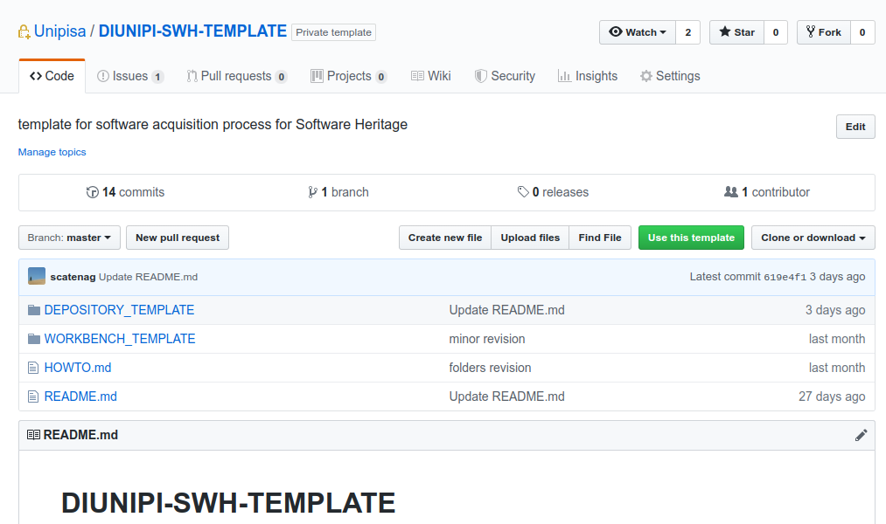
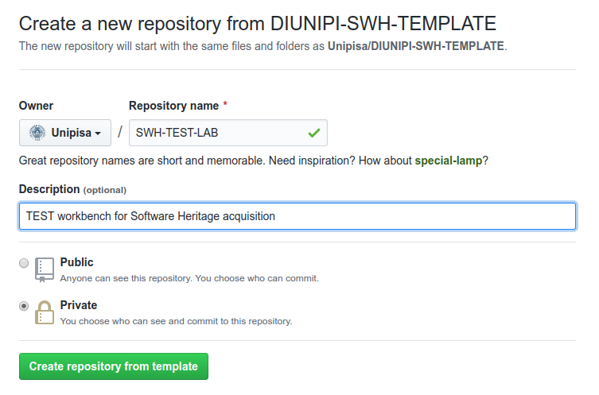
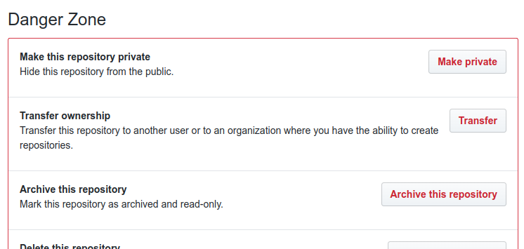

**Join us !**

Se in universita di Pisa

1. entra organizzazione

2. entra nel team

Se non sei contatta (creazione repo da amministratore e invito come collaboratore esterno).

**Then**

1. leggi [documentazione](THE_PROCESS.md) sul processo
2. instanzia il processo:
  * descrivere il processo di istanziazione nel dettaglio

**Instantiate the Workbench from [SWHAP-TEMPLATE](https://github.com/Unipisa/SWHAP-TEMPLATE) via GitHub.com**

Make a new repository SWHAP-TEMPLATE (see the following figure)

   1. go to [DIUNIPI-SWH-TEMPLATE](https://github.com/Unipisa/SWHAP-TEMPLATE) and click on ["Use this template"](https://github.com/Unipisa/SWHAP-TEMPLATE/generate)

   2. fill the name with SWG-$SW_NAME-LAB and the description as in figure

   3. You got a new repository with the file and directory structure of [DIUNIPI-SWH-TEMPLATE](https://github.com/Unipisa/SWHAP-TEMPLATE)

then on terminal

~~~
$ mkdir SWH-$SW_NAME-LAB
$ cd SWH-$SW_NAME-LAB
$ git init
$ git remote add origin https://github.com/Unipisa/SWH-$SW_NAME-LAB.git
$ git push -u origin master
~~~

**Fill the DEPOSITORY**

**Finalize and archive the DEPOSITORY**

~~~
$ git clone SWH-$SW_NAME-LAB.git
$ cd SWH-$SW+NAME-LAB
$ git filter-branch --prune-empty --subdirectory-filter DEPOSITORY master
> creare repository SWH-$SW_NAME-DEPOSITORY
> git set-url origin SWH-$SW_NAME-DEPOSITORY.git
> aggiornare journal con data chiusure repository
> achiviare repository e settarlo pubblico
$ cd ..
$ cd SWH-$SW_NAME-LAB
$ cp DEPOSITORY/ACTORS.md WORKBENCH_TEMPLATE   
$ cp -r DEPOSITORY/SOURCE WORKBENCH_TEMPLATE/  
$ rm -R DEPOSITORY
~~~

Then, [archive](<https://help.github.com/en/articles/archiving-repositories>) the depository repository (under repository settings, in the Danger Zone).

and write into SWHAP@PISA JOURNAL.md or notify @Unipisa/swhap-pisa-administrators  

**Create the synthetic Git**

todo